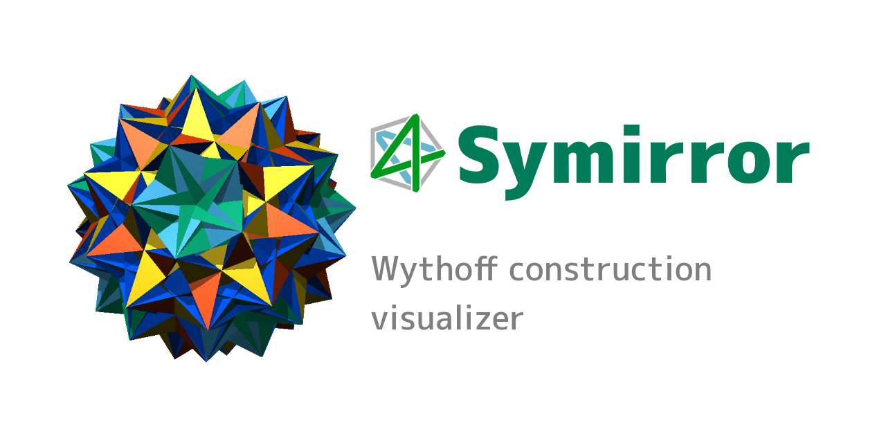

# Symirror

[Download latest Symirror3 (1.3.0)](https://github.com/mino-ri/Symirror/releases/download/v1.3.0/Symirror3_1_3_0.zip)

## What is Symirror?

Symirror is a polytope visualizer by a *Wythoff construction*.
